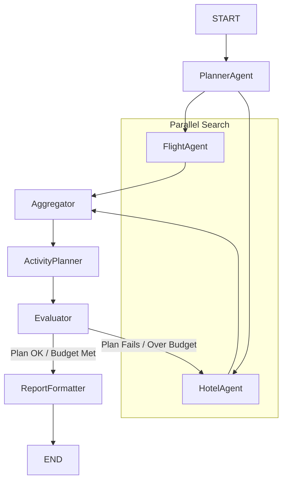

# Autonomous AI Travel Agent with Self-Correction

An AI travel agent built with LangGraph for cyclical agent orchestration, powered by Groq and Tavily. This project demonstrates a stateful, multi-agent system that can plan, research, write, evaluate, and self-correct to generate a detailed travel itinerary based on a single natural language request.

---

## Overview

Planning a trip is a complex task that involves balancing multiple constraints like budget, interests, and time. This project automates the entire process using an autonomous AI agent system. The agent takes a high-level user request (e.g., "a 5-day trip to Rome for 2 people with a €2000 budget, focusing on history") and orchestrates a team of specialized AI agents to produce a complete, logical, and budget-compliant travel plan.

The core of this project is its ability to not only generate a plan but also to **evaluate its own work and self-correct**, making it a robust and intelligent planning tool.

---

---

## Features

-   **Autonomous End-to-End Planning:** Generates a full itinerary from a single prompt without human intervention.
-   **Multi-Agent Orchestration:** Uses a graph-based approach to manage a team of specialized agents (Planner, Researcher, Critic, etc.) that collaborate to achieve a common goal.
-   **Parallel Task Execution:** Increases efficiency by running independent tasks, like flight and hotel searches, concurrently.
-   **Self-Correction & Budget Control:** A built-in `Evaluator` agent checks the generated plan against user constraints (like budget). If the plan fails, it triggers a refinement loop to find better alternatives.
-   **Data-Driven with Tools:** Agents use tools to gather information from external data sources (simulated via JSON files), making plans grounded in data.
-   **Structured & Formatted Outputs:** Delivers the final plan as a structured Pydantic object and also provides user-friendly, styled `Markdown` and `HTML` reports.

---

## System Architecture & Workflow

The system is modeled as a stateful graph (`StateGraph`) in LangGraph. Each node represents an agent or a specific function, and edges define the flow of information and control.


1.  **Planner Agent:** Parses the user's request into a structured `TripRequest` object.
2.  **Flight & Hotel Agents:** These agents run **in parallel** to find travel and accommodation options based on the plan.
3.  **Aggregator:** This node waits for both parallel searches to complete before allowing the process to continue.
4.  **Activity Planner Agent:** Takes all the gathered information and the user's interests to create a detailed, day-by-day itinerary.
5.  **Evaluator Agent:** The quality control gate. It checks the complete plan against the user's budget.
6.  **Conditional Edge (The Loop):** Based on the Evaluator's output, the graph either proceeds to the final step or **loops back** to the `hotel_agent` to find a cheaper option.
7.  **Report Formatter:** If the plan is approved, this final node creates the `.md` and `.html` report files.



---

## Tech Stack

| Tool/Library | Purpose |
| :--- | :--- |
| **Groq** | Ultra-fast Llama 3 inference for all agentic reasoning. |
| **LangChain** | Core framework for LLM interactions and tool definitions. |
| **LangGraph** | The star of the show; orchestrates the stateful, multi-agent graph with cycles. |
| **Pydantic** | Ensures data is structured and reliable throughout the entire workflow. |
| **Tavily** | Real-time web search capabilities. |
| **markdown2** | Converts the final report from Markdown to HTML. |
| **Python 3.10+** | The programming language foundation. |


---

##  Installation & Setup

To get a local copy up and running, follow these steps.

**1. Clone the Repository**
```bash
git clone https://github.com/berkyalkn/AI-travel-agent
cd AI-travel-agent
```

**2. Create and Activate a Virtual Environment**
```bash
python3 -m venv venv
source venv/bin/activate
# On Windows, use: `venv\Scripts\activate`
```

**3. Install Dependencies**
```bash
pip install -r requirements.txt
```
> **Note:** You can create the `requirements.txt` file with `pip freeze > requirements.txt`.

**4. Set Up API Keys**

- Create a .env file in the root folder with your API keys:
- Open the .env file and enter your own API keys:
```
GROQ_API_KEY="your_groq_api_key"
TAVILY_API_KEY="your_tavily_api_key"
```

**5. Verify Mock Data**
Ensure the `mock_data/` directory exists and contains `flights.json`, `hotels.json`, and `activities.json`.

#### Mock Data Format

1- flights.json

```json
[
  {
    "destination": "New York",
    "origin": "Istanbul",
    "airline": "AirExample",
    "base_price_per_person": 800.0
  }
]
```

2- hotels.json

```json
[
  {
    "destination": "New York",
    "hotel_name": "Hotel Fancy",
    "price_per_night_for_two": 300,
    "rating": 4.5
  }
]
```

3- activities.json

```json
{
  "food": [
    {
      "name": "Pizza Tour",
      "description": "Try NYC's famous pizza spots.",
      "location": "Manhattan",
      "time_of_day": "Afternoon"
    }
  ],
  "adventure": [
    {
      "name": "Central Park Biking",
      "description": "Bike around Central Park.",
      "location": "Central Park",
      "time_of_day": "Morning"
    }
  ]
}
```


---

## How to Run

1.  Open the main Jupyter Notebook (`travel_agent.ipynb`).
2.  Navigate to the last cell of the notebook.
3.  Modify the `user_query` variable to define the trip you want to plan.
4.  Run all the cells.
5.  The final report will be displayed in the notebook and saved in the `output/` directory as `trip_itinerary.md` and `trip_itinerary.html`.


#### Example Query

```python
user_query = "I want to plan a 6-day trip to New York with my two best friends. We are interested in adventure and food, and our total budget is around 10000 euros."
```

Produces: 

- Parsed structured plan
- Flight and hotel pricing
- 6-day activity itinerary 
- Markdown + HTML export


---

##  Key AI Concepts Demonstrated

This project is a practical implementation of several advanced concepts in AI engineering:
-   **Structured Output:** Forcing LLM outputs into reliable Pydantic schemas.
-   **Tool Binding:** Enabling LLMs to use external functions to gather data.
-   **Parallelization:** Executing multiple independent tasks concurrently to improve efficiency.
-   **Routing & Conditional Logic:** Using conditional edges to dynamically alter the flow of the application based on intermediate results.
-   **Orchestration:** Managing a complex, multi-step process involving multiple specialized agents.
-   **Evaluation & Reflection:** Creating an agent that can critique the output of the system and trigger a self-correction loop.