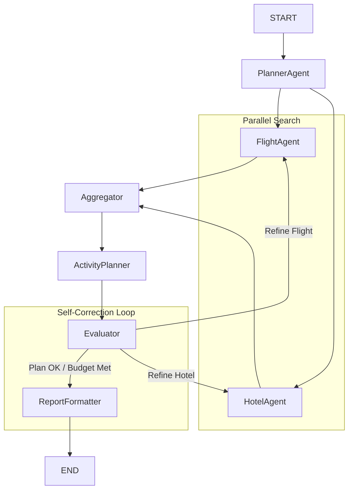

# Autonomous AI Travel Agent with Self-Correction

An AI travel agent built with LangGraph for cyclical agent orchestration, powered by Groq and Tavily. This project demonstrates a stateful, multi-agent system that can plan, research, write, evaluate, and self-correct to generate a detailed travel itinerary based on a single natural language request.

---

## Overview

This project automates the entire travel planning process using an autonomous AI agent system. The agent takes a high-level user request (e.g., "a 5-day trip from Antalya to Rome for 2 people with a €2000 budget, focusing on history") and orchestrates a team of specialized AI agents. It connects to live APIs for flight and hotel data and uses real-time web search for activities to produce a complete, logical, and budget-compliant travel plan.

The core of this project is its ability to not only generate a plan but also to evaluate its own work against user constraints and self-correct, making it a robust and truly intelligent planning tool.

---

## Features

-   **Autonomous End-to-End Planning:** Generates a complete itinerary from a single natural language prompt.
- **Live API Integration:** Connects to real-time APIs for flights and hotels, and uses live web search (Tavily) for activities, grounding all plans in current, real-world data.
-   **Multi-Agent Orchestration:** Uses LangGraph to manage a stateful team of specialized agents (Planner, Researcher, Evaluator, etc.) that collaborate to achieve a goal.
-   **Parallel Task Execution:**  Efficiently searches for flights and hotels concurrently.
-   **Intelligent Self-Correction & Multi-Path Refinement:** A built-in Evaluator agent checks the plan against user constraints (e.g., budget). If the plan fails, it intelligently decides whether to refine the flight or the hotel and triggers a revision loop.
-   **Structured & Formatted Outputs:** Delivers the final plan as both a structured Pydantic object and user-friendly, styled Markdown and HTML reports.

---

## System Architecture & Workflow

The system is modeled as a stateful graph (`StateGraph`) in LangGraph. Each node represents an agent or a specific function, and edges define the flow of information and control.


1.  **Planner Agent:** Parses the user's natural language request into a structured `TripRequest` object containing all key constraints (destination, dates, budget, etc.).
2. **Parallel Data Gathering (Flight & Hotel Agents):** These agents run in parallel to query live, real-time APIs for the best travel and accommodation options, returning a list of top choices for each. An initial selection is made (e.g., cheapest flight, best-rated hotel).
3. **Activity Planning Agent:** This agent takes the user's interests, performs live web searches using Tavily to find relevant, specific activities (not just generic tours), and then uses an LLM to analyze the search results and create a structured, day-by-day itinerary.
4. **Evaluator Agent (The Strategist):** The quality control gate. This agent analyzes the complete drafted plan (flight, hotel, costs) against user constraints and the available alternatives. It performs a strategic, value-based analysis to decide if the plan is optimal.
5. **Multi-Path Self-Correction Loop:** Based on the Evaluator's strategic decision, the graph uses a conditional edge to either approve the plan or trigger a self-correction loop. The loop can intelligently route the process back to the hotel_agent to find a cheaper hotel or back to the flight_agent to find a cheaper flight, depending on where the best potential saving lies.
6.  **Aggregator:** This node waits for both parallel searches to complete before allowing the process to continue.
7.  **Report Formatter:** Once the plan is approved, this final node creates the user-friendly .md and styled .html report files.


---

## Tech Stack

| Tool/Library | Purpose |
| :--- | :--- |
| **Groq** | Ultra-fast Llama 3 inference for all agentic reasoning. |
| **LangChain** | Core framework for LLM interactions and tool definitions. |
| **LangGraph** |  Orchestrates the stateful, multi-agent graph with cycles and parallel execution. |
| **Pydantic** | Ensures data is structured and reliable throughout the entire workflow. |
| **RapidAPI** | Platform for accessing live Flight and Hotel APIs. |
| **Tavily** | Live web search for finding real-time activity information.  |
| **Requests** | HTTP library for making API calls. |
| **markdown2** | Converts the final report from Markdown to HTML. |
| **Python 3.10+** | The programming language foundation. |


---

##  Installation & Setup

To get a local copy up and running, follow these steps.

**1. Clone the Repository**
```bash
git clone https://github.com/berkyalkn/AI-travel-agent
cd AI-travel-agent
```

**2. Create and Activate a Virtual Environment**
```bash
python3 -m venv venv
source venv/bin/activate
# On Windows, use: `venv\Scripts\activate`
```

**3. Install Dependencies**
```bash
pip install -r requirements.txt
```
> **Note:** You can create the `requirements.txt` file with `pip freeze > requirements.txt`.

**4. Set Up API Keys**

- Create a .env file in the root folder with your API keys:
- Open the .env file and enter your own API keys:
```
GROQ_API_KEY="your_groq_api_key"
TAVILY_API_KEY="your_tavily_api_key"
RAPIDAPI_KEY="your_rapid_api_key"
```

---

## How to Run

1.  Open the main Jupyter Notebook (`travel_agent.ipynb`).
2.  Navigate to the last cell of the notebook.
3.  Modify the `user_query` variable to define the trip you want to plan.
4.  Run all the cells.
5.  The final report will be displayed in the notebook and saved in the `output/` directory as `trip_itinerary.md` and `trip_itinerary.html`.


#### Example Query

```python
user_query = "I want to plan a 6-day trip to New York with my two best friends. We are interested in adventure and food, and our total budget is around 10000 euros."
```

Produces: 

- Parsed structured plan
- Flight and hotel pricing
- 6-day activity itinerary 
- Markdown + HTML export


---

##  Key AI Concepts Demonstrated

This project is a practical implementation of several advanced concepts in AI engineering:
-   **Structured Output:** Forcing all LLM outputs, from initial planning (TripRequest) to the final plan (Itinerary) and evaluation (EvaluationResult), into reliable Pydantic schemas to ensure data integrity and predictable workflows.
-   **Tool Binding & Live API Integration:** Enabling agents to use external functions to gather information from live, real-time APIs (for flights and hotels) and the unstructured web (for activities via Tavily Search).
-   **Parallelization:** Executing independent data-gathering tasks (flight and hotel searches) concurrently to significantly reduce total execution time.
-   **Advanced Routing & Conditional Logic:** Using conditional edges to create a multi-path, self-correcting loop. The graph dynamically routes its own execution path back to different agents (hotel_agent or flight_agent) based on the strategic output of the Evaluator agent.
-   **Stateful Multi-Agent Orchestration:** Using LangGraph to manage a complex, multi-step process where multiple specialized agents collaborate and share information through a persistent state (TripState).
-   **Evaluation & Reflection:** Creating a dedicated Evaluator agent that critiques the system's own output against user constraints and available alternatives, enabling true autonomous decision-making and refinement.